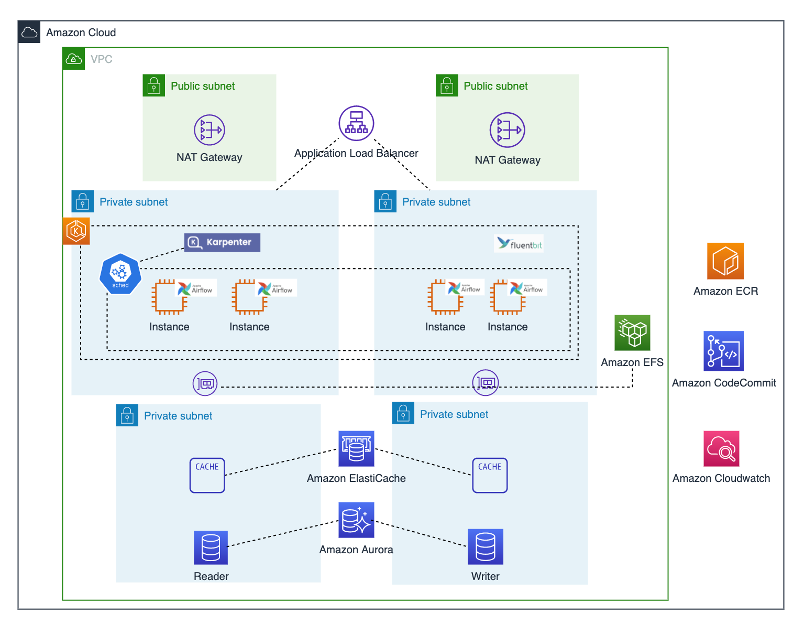

# Graviton2-based Airflow on the Amazon Cloud 

The solution is for deploying high reliable Apache Airflow(https://airflow.apache.org/) on the Amazon Cloud.  The whole stack is based on Graviton2. 

## Use cases

- For users who wants to accelarate the Ariflow deployment and build it in production.

## Technical Details

### The Airflow Components

In this solution, we deploy the following Airflow components:
- Web UI
- Scheduler(Celery)
- Worker
- KEDA, for Airflow AutoScaling(https://airflow.apache.org/docs/helm-chart/stable/keda.html)

Relevant Technical points used in the Airflow components:
- PgBouncer. If you are using PostgreSQL as your database, you will likely want to enable PgBouncer as well. Airflow can open a lot of database connections due to its distributed nature and using a connection pooler can significantly reduce the number of open connections on the database.(https://github.com/pgbouncer/pgbouncer)

- Git-Sync. Git-Sync is a simple command that pulls a git repository into a local directory. It is a perfect "sidecar" container in Kubernetes - it can periodically pull files down from a repository so that an application can consume them. (https://github.com/kubernetes/git-sync)


### Solution Architecture on AWS 




The architecture details:

1. To ensure high availability, this solution supports deployment in two availability zones.

2. Amazon VPC: Build a reliable and secure virtual network, and deploy the resources in the public subnet and private subnet in the VPC.

3. Amazon EKS: Use EKS to deploy the main components of Airflow, such as Web UI, Scheduler, Worker, etc. The underlying computing resources all use Graviton2 based EC2, and all the image sources of EKS are Amazon ECR. Karpenter automatically launches just the right EC2 resources to handle your Airflow applications.

4. Amazon Aurora for PostgreSQL: Use PostgreSQL as the metadata storage backend of Airflow, and choose the managed service Amazon Aurora for PostgreSQL as a database service, which reduces the time of daily operation and maintenance, and enhances availability and reliability.

5. Amazon ElastiCache for Redis: Use Redis as the Airflow message queue middleware, choose Amazon ElastiCache for Redis in this solution.

6. Amazon CodeCommit: Stores the code of the Airflow DAG.

7. Amazon EFS: DAG code sharing is realized through EFS, which also serves as the persistent storage of EKS.

8. Amazon CloudWatch: Two functions here, 1) Amazon CloudWatch Logs, collect Airflow logs through FluentBit, in addition to the Airflow UI, you can directly see the logs through Cloudwatch. 2) Container Insight collects relevant monitoring indicators.


## How to deploy
### Prerequisites
1. At first, please prepare the ARM based docker image, if you are not familiar with this, we have prepared the build script is in the docker path. 
    - Airflow, version 2.3.4
    - Keda, version 2.0.0
    - PgBouncer, version 1.14.0

For the Git-Sync, we donot prepare this, you can use the official Arm-Based image.If you are using MacOX, you can use the following command to check the image 
```
docker buildx imagetools inspect k8s.gcr.io/git-sync/git-sync:v3.4.0
```

2. Second, the solution is deployed in the China partition, so that we prepared some Kubernates resource files and replace the ARN or service endpoint in advance. The files are in the resources path, please use these files.


### Steps to set up Airflow cluster:

1. Set up an Graviton2 EC2 bastion host, this instance has two function.
    - Build your ARM images
    - Deploy the following Airflow stack 

2. Check your system requirement, prepare the relevant tools.
    - kubectl
    - eksctl 
    - helm 
    - python3

    ``` 
        bash 00-check-requirements.sh
    ```
3. Preapre the AWS infrastracture, including VPC, EKS, Aurora, ElastiCache and etc. This step takes around 40 minutes.
    ``` 
        bash 01-setup-infra.sh
    ```
4. Set up Karpenter, Karpenter automatically launches just the right compute nodes to handle your EKS cluster's applications.
    ``` 
        bash 02-setup-karpenter.sh
    ```
5. Set up CloudWatch for Airflow logs and metrics.
    ``` 
        bash 03-setup-cloudwatch.sh
    ```
6. Set up ALB ingress, Application Load Balancer (ALB) is provisioned that load balances traffic for Airflow Web UI.

    ``` 
        bash 04-setup-alb-ingress.sh
    ```

7. Set up Airflow, 
    ``` 
        bash 04-setup-alb-ingress.sh
    ```
## Limitations
1. The solution now supports China Amazon Cloud
